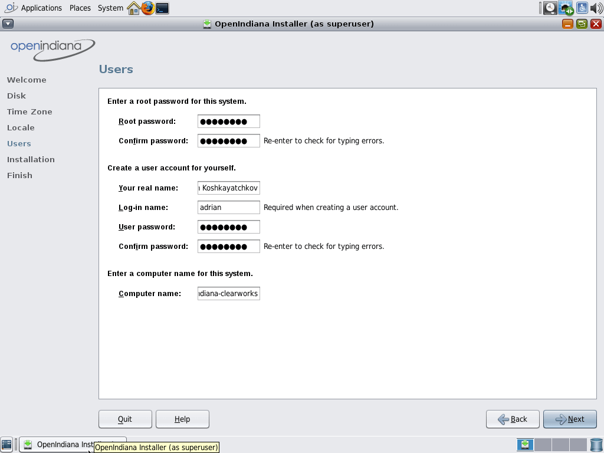
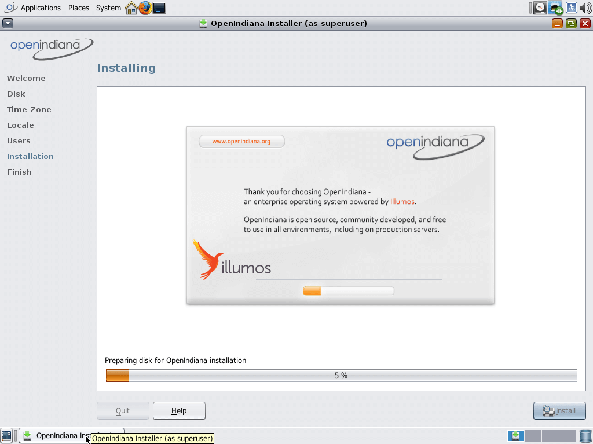

# Install OpenIndiana (Hipster) 

1. Select your keyboard layout

Here put in whatever number is next to your keyboard layout name.(e.g. 47 for US-English, 46 for UK-English, etc.)

Here is pretty much the same as the last step, but this sets the display language.(i.e. what language the user-interface is in)

As soon as the desktop loads, click "Install OpenIndiana" and this screen will appear, click next. (if you get error dialogue boxes, just close them)

 

Here you can just select "Use the whole disk" if you're only going to install OpenIndiana on this system, otherwise you can Selection "Parition the disk" and partition it accordingly.

On this screen you select your region, location, timezone, date, and time. Also whether you want 24 hour or 12 hour time.

This screen is for seting up the locale which controls things like default language support, date formats, etc.

Enter your root password, your "real name", "username" and your users password, Also set a hostname(computer-name).

And now you play the waiting game, the system is now seting up itself/installing. Go make a cup of coffee, snuggle a loved one, or something! It might be a while.

Your installation of OpenIndiana installed correctly,(at least I hope so!)you can now reboot into your new shiny system!

